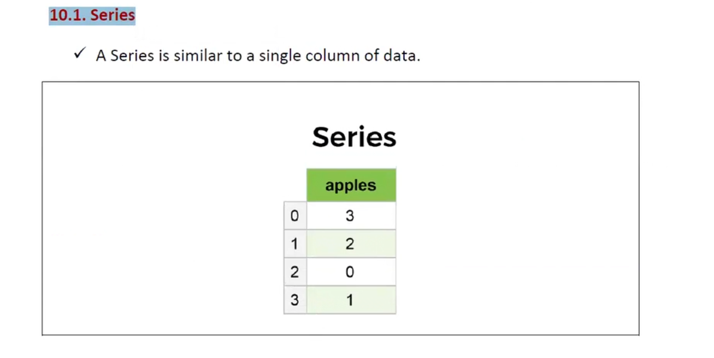
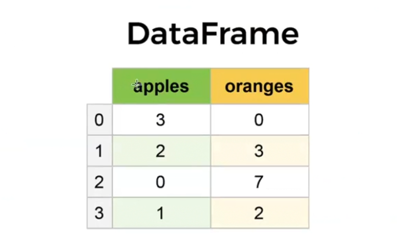
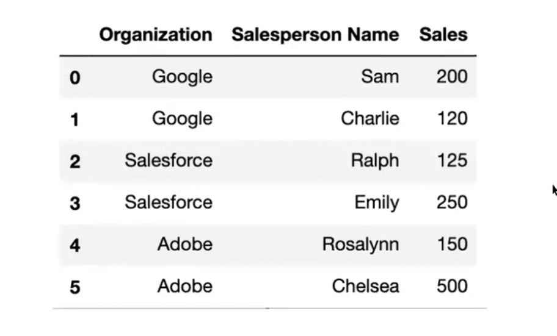
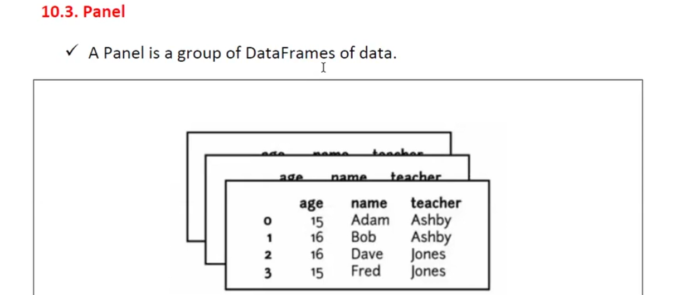
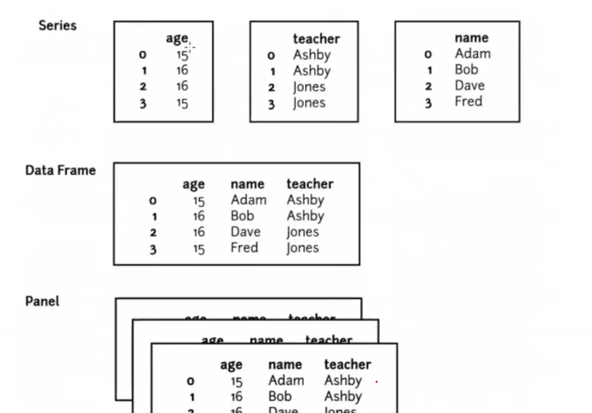

# Pandas Data Structures

## 1. Introduction to Pandas

**Pandas** is an open-source Python library used for **data analysis**.

### What is Data Analysis?

Data analysis means examining data to understand useful information such as:

- Minimum value
- Maximum value
- Middle value
- Even and odd values
- Sum/total
- Other useful patterns and information

For example, consider:

```text
1, 2, 3, 4, 5, 6, 7, 8, 9
```

Some basic analysis is:

```text
Minimum = 1
Maximum = 9
Middle  = 5

Even numbers = 2, 4, 6, 8
Odd numbers  = 1, 3, 5, 7

Sum = 45
```

> **Note:** The original notes mention a sum of 55. For the displayed values 1 through 9, the sum is **45**.

Pandas is useful for working with and analyzing large amounts of data.

---

## 2. Learning Pandas = Learning Data Structures

To understand Pandas, it is useful to first understand Python's basic data structures.

### Python Data Structures

```text
List
Tuple
Set
Dictionary
```

### Pandas Data Structures

The notes introduce these Pandas data structures:

```text
Series
DataFrame
Panel
```

A simple way to remember them is:

```text
Series    → 1D → Single column
DataFrame → 2D → Rows + Columns
Panel     → 3D → Group of DataFrames
```

---

# 3. Series

A **Series** can be thought of as a **single column of data**.

### Key Points

- A Series represents **1-dimensional (1D)** data.
- It stores data in a column-like format.
- A Series is a predefined Pandas data structure.
- It is similar to a single column in a table.

### Example

```text
Index    apples
  0         3
  1         2
  2         0
  3         1
```

This can represent apple sales over four days:

```text
Day 1 → 3 apples sold
Day 2 → 2 apples sold
Day 3 → 0 apples sold
Day 4 → 1 apple sold
```



### Other Series Examples

A Series can contain names:

```text
Nireekshan
Anil
Sunil
Sukanya
Subbamma
Rangamma
```

Or numbers:

```text
1
2
3
4
5
```



---

# 4. DataFrame

A **DataFrame** stores data in **rows and columns**.

It can be thought of as a table containing multiple columns of data.

### Key Points

- A DataFrame represents **2-dimensional (2D)** data.
- It contains **rows + columns**.
- It is useful for storing tabular data.
- The number of rows and columns describes the **shape** of the DataFrame.

### Example

```text
        Name       Mobile        Mailid
------------------------------------------------
0       John       9032804339    pjwesley7@gmail.com
1       Wesley     8019710358    johnwesley292@gmail.com
```

The above DataFrame has:

```text
Rows    = 2
Columns = 3
Shape   = (2, 3)
```



---

# 5. Series vs DataFrame

| Data Structure | Dimension | Used For | Simple Example |
|---|---:|---|---|
| **Series** | 1D | Single column of data | Apples |
| **DataFrame** | 2D | Rows and columns | Apples + Oranges |
| **Panel** | 3D | Group of DataFrames | Multiple DataFrames |

### Visual Representation

```text
Series
  ↓
Single column
  ↓
1D
```

```text
DataFrame
  ↓
Rows + Columns
  ↓
2D
```

```text
Panel
  ↓
Group of DataFrames
  ↓
3D
```

---

# 6. Series and DataFrame Example

Suppose we have:

```text
        apples    oranges
0          3         0
1          2         3
2          0         7
3          1         2
```

The `apples` column by itself can be considered a **Series**:

```text
0    3
1    2
2    0
3    1
```

The complete table containing `apples` and `oranges` is a **DataFrame**:

```text
   apples  oranges
0       3        0
1       2        3
2       0        7
3       1        2
```

### Data Analysis on the Example

#### Apples

```text
Minimum = 0
Maximum = 3
Total   = 6
```

#### Oranges

```text
Minimum = 0
Maximum = 7
Total   = 12
```

> **Note:** The original notes mention the oranges total as 6. Based on the displayed values `0 + 3 + 7 + 2`, the total is **12**.



---

# 7. Panel

A **Panel** is described in the notes as a **group of DataFrames**.

In other words:

```text
Multiple DataFrames
        ↓
      Panel
```

This represents **3-dimensional (3D)** data in the terminology used in these notes.



### Visual Understanding

```text
Series
   ↓
Single column
   ↓
1D


DataFrame
   ↓
Rows + Columns
   ↓
2D


Panel
   ↓
Group of DataFrames
   ↓
3D
```

---

# 8. What Can We Do Using Pandas?

The notes identify four major activities:

1. **Data Loading**
2. **Data Preparation**
3. **Data Manipulation**
4. **Data Analysis**

A simple flow is:

```text
Raw Data
   ↓
Data Loading
   ↓
Data Preparation
   ↓
Data Manipulation
   ↓
Data Analysis
```

---

# 9. Important Points to Remember

### Series

> **Series = Single column = 1D**

Example:

```text
0    3
1    2
2    0
3    1
```

### DataFrame

> **DataFrame = Rows + Columns = 2D**

Example:

```text
   apples  oranges
0       3        0
1       2        3
2       0        7
3       1        2
```

### Panel

> **Panel = Group of DataFrames = 3D**

---

# 10. Quick Revision

```text
Python
├── List
├── Tuple
├── Set
└── Dictionary

Pandas
├── Series    → 1D → Single column
├── DataFrame → 2D → Rows + Columns
└── Panel     → 3D → Group of DataFrames
```

### One-Line Memory Trick

**Series → Column**

**DataFrame → Table**

**Panel → Group of Tables**

---

## 11. Summary

Pandas provides data structures that help organize and analyze data.

- **Series** → 1D, single column of data
- **DataFrame** → 2D, rows and columns
- **Panel** → 3D, group of DataFrames
- Pandas can be used for **data loading, preparation, manipulation, and analysis**.

The most important concepts to understand first are **Series and DataFrame**.
